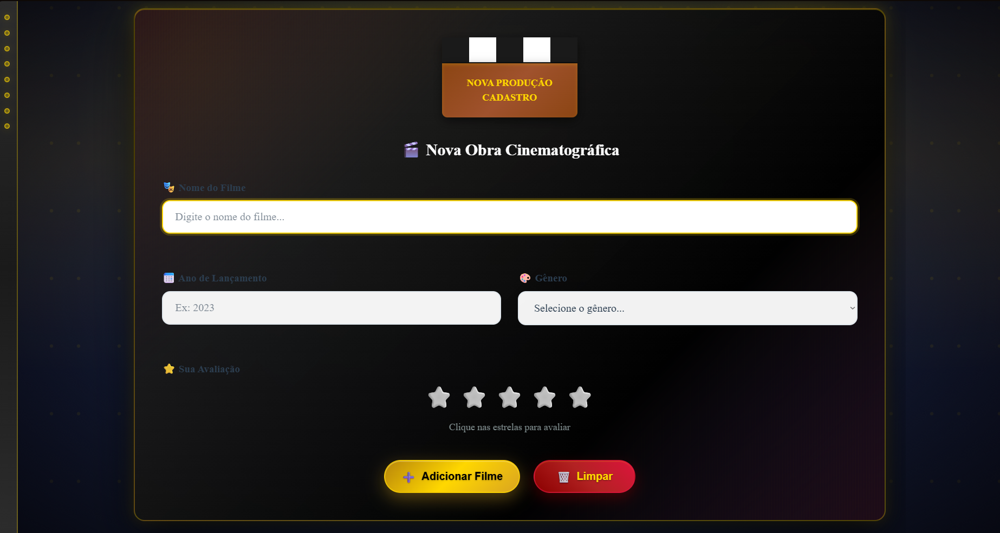

# CineManager Pro

Um projeto front-end simples com estética vintage para gerenciar um pequeno arquivo cinematográfico localmente.

Este repositório contém uma página estática (HTML/CSS/JS) que permite cadastrar filmes, filtrar, ordenar, exportar/importar a lista e navegar por um arquivo estilo "cinema".

## Conteúdo do repositório

- `index.html` - Interface principal do aplicativo.
- `style.css` - Estilos e tema vintage do app.
- `script.js` - Lógica JavaScript (validação do formulário, filtros, armazenamento local, export/import).
- `assets/` - Capturas de tela e imagens usadas no README e desenvolvimento.

## Pré-visualização

